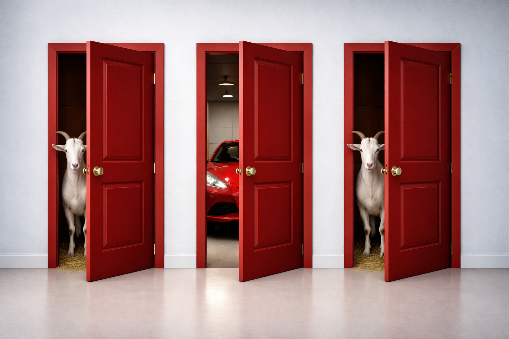

The Monty Hall problem is one of the most famous probability puzzles, of which the answer still feels wrong even when you're told it's right.

The problem is as follows:
There are 3 doors. Behind one is a car, behind the other two are goats. You pick a door. Obviously, the aim is to get the car.
The host (who knows where the car is) opens one of the other doors to reveal a goat. Now you get a choice, to stick with your door, or do you switch?

Most people choose to stick with their initial intuition. But this is wrong!

------

When you first pick a door, you have a 1 in 3 chance of being right. That means there's a 2 in 3 chance the car is behind one of the other two doors.
When the host reveals a goat, that 2/3 probability doesn't disappear, it all shifts onto the one remaining door. 
So by switching, the probability that you open the door to a car by switching becomes 66.7%. 
The probability you get a car by staying with your door...only 33.3%.

Switching doubles your chances!
